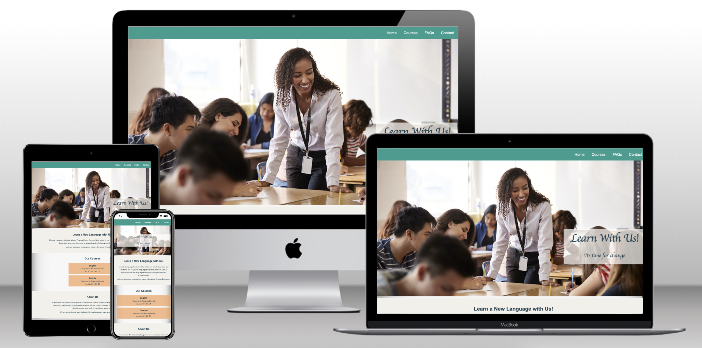
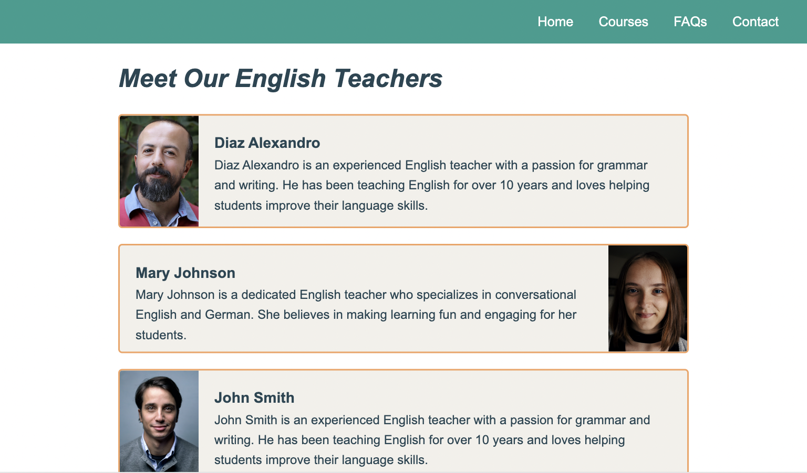
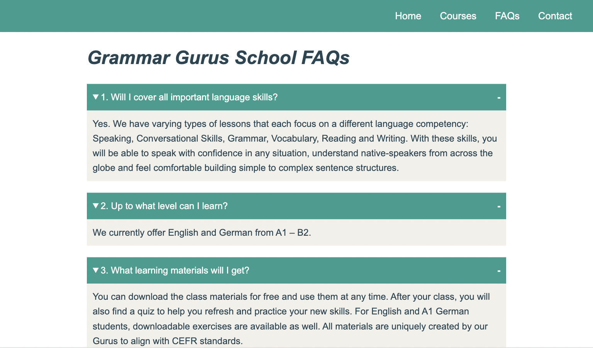
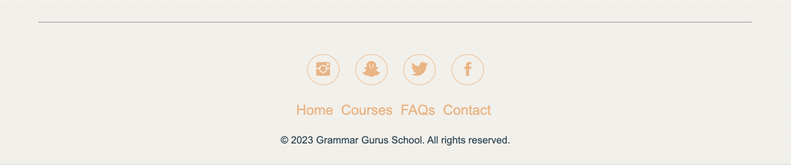
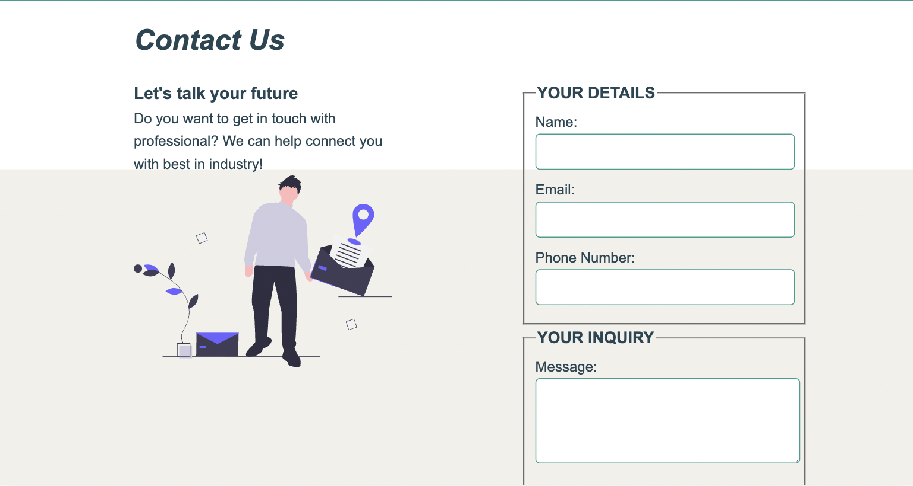

# Grammar Gurus

Grammar Guru is an online platform where German and English classes are offered by professionals, which can be easily scheduled from the platform itself around the globe. The classes will be offered by the highly qualified and certified teachers. You're just a meassage away from mastering the art of German and English.



# Table of Contents

1. [Introduction](#introduction)
1. [Technology Used](#technology-used)
1. [Color Palette](#color-palette)
1. [Website Structure](#website-structure)
1. [Features](#features)
1. [Testing](#testing)
   - [Bugs](#bugs)
1. [Deployment](#deployment)
1. [Credits](#credits)
   - [Content](#content)
   - [Media](#media)
   - [Acknowledgements](#acknowledgements)

### Technology Used

- HTML
- CSS
- Balsamiq: To create a wireframe

### Color Palette

A separate portion has been created for storing color values which are referenced throughout using var

```css
:root {
  --primary-color: #2a9d8f;
  --secondary-color-dark: #f4a261;
  --secondary-color: #f4a361bb;
  --accent-color: #e9c46a;
  --hard-color: #e76f51;
  --dark-color: #264653;
  --background-color: #f2f0eb;
  --dark-text-color: #264653;
  --hero-text-background-color: rgba(255, 253, 250, 0.7);
}
```

### Website Structure

1. **_Home / Landing page:_** Informative page for displaying major functionalities of the platform
2. **_FAQs:_** To show frequently asked questions
3. **_Contact:_** A contact form to contact me via the webpage.
4. **_Header:_** Proper Navigation bar
5. **_Footer:_** This is a section of the website with social media links and copywriting information.

### Features

- **Navigation Bar**

  - Featured on all five pages, the full responsive navigation bar includes links to the Home page, Courses, Frequently Asked Questions and Contact page and are present on each page for the easy navigation to the respective pages.
    

- **The hero page image**

  - The hero includes an image with text overlay to allow the user to instantly understand what the website is about.
  - This section introduces the user to Grammar Gurus an eye catching image to grab their attention
    

- **Site Description Section**

  - This section provides the importance of joining the Grammar Gurus and how it can help the user to reach the certain level at specific language.

- **Courses Section**

  - The courses section will allow the user to check the courses offered by Grammar Gurus i.e. German and English
  - When the user click on the desired course, an another page opens about the information of professionals teaching the desired course.
    
    

- **FAQs section**

  - This section will allow the user to see most common frequently asked questions.
  - This section also has a button for additional questions which user might be having regarding Grammar Gurus.
  - The button will lead the user to another page of all the frequently asked questions with their answers.
    

- **The Footer**

  - The footer section includes links to the social media sites (e.g. instagram, snapchat, twitter, facebook) for Grammar Gurus.
  - The footer section also has links to the other pages for the easy navigation.
  - The footer has copyright of Grammar Gurus as well.
    

- **The Contact Page**

  - The contact page will enable the user to enter their details (Name, Email, Phone number) and send the inquiry to Grammar Gurus.
  - The contact details are required in order to be contacted by Grammar Gurus about the courses.
    

### Future Section to be added

- Client Testimonials
- Partners

## Testing

- I tested the site, and it works in different web browsers: Chrome, Firefox, and Microsoft Edge.
- On mobile devices, I tested the website site on a iPhone 12 Pro with safari browser and on Samsung Note 20 .
- The website is responsive and functions on different screen sizes using the devtools device toolbar.
- The navigation and the sections Home, Courses, FAQs, About us and Contact are readable and easy to understand.
- The form present on the contact page works: it requires entries in every field, only accepts an email in the email field, and the submit button works.

### Bugs

1. **Solved bugs**

- After deploying my project on GitHub, I found that the text overlaying the hero image was
  The hero image section was conflicting with the navbar so I gave the z-index the value of -1000 to solve the issue.
- Collapsable FAQs was not possible without javascript so I used ‘Detailed Tags’ for FAQs which provide summary in paragraph sections.

2. **Unfixed Bugs**

- Detailed Tag by default comes with an arrow which I was not able to remove.
- Providing href to button was not possible so I had to use anchor tag over button.
- Giving partial color to background was not possible so I used footers background color in contact page.

## Deployment

- The site was deployed to Git Hub pages using the following steps:

  - In the Github repository, the Setting tab.
  - Under General, navigate to Code and Automation and select 'Pages'.
  - In the Build and Deployment section for Source, select 'Deploy from a branch' from the drop-down list.
  - For Branch, select ‘master’ from the drop-down list and Save.
  - On the top of the page, the link to the complete website is provided.

  * The deployed site will update automatically upon new commits to the master branch.

## Credits

### Content

- The footer section was inspired by https://jsfiddle.net/Grobbert/gmqth51o/1/
- The contact page was taken by https://preview.colorlib.com/theme/bootstrap/contact-form-16/
- To add the overlay to the home page, I took the idea from Code Institute Love Running Project.

### Media

- The image used as a background image for the index.html is taken from shutterstock.
- The portraits of the professionals were taken from the shutterstock free samples.

### Acknowledgements

- Ideas were taken from the Code Institute's Coffee House and Love Running projects.
- My mentor, Medale Oluwafemi, for his invaluable guidance and mentoring.
